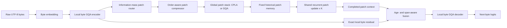
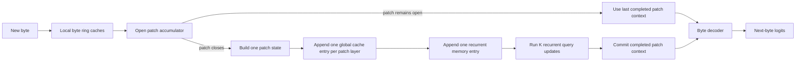
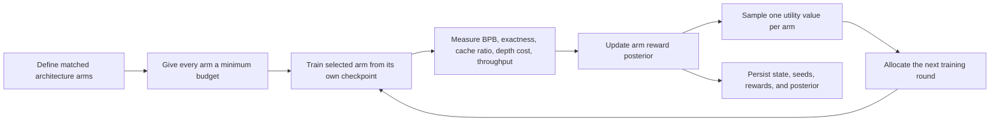

# CARS-R 0.1.0

## Causal Adaptive Recurrent Scaling for byte-level language modeling

CARS-R is a research architecture for studying whether a language model can allocate computation along two independent axes:

1. **sequence granularity** — learn how many causal bytes should be compressed into one patch;
2. **latent depth** — reuse one shared patch-level block for a selectable number of recurrent updates.

Version **0.1.0** is the first research implementation. It is not a production inference server and it is not a claim of state-of-the-art quality.

The architecture has now passed a controlled small-scale pilot: it trains from scratch, supports cached autoregressive generation, learned patching and CPLA execute correctly under the focused test suite, and frozen pilot checkpoints were compared against matched byte- and token-level GQA/MLA controls. The repository still does **not** bundle an official pretrained checkpoint. A larger-corpus replication is the next milestone before any fine-tuning or stronger quality claim.

---

## Research status

| Item | Status in 0.1.0 |
|---|---|
| Architecture implementation | Complete |
| Unit and equivalence tests | Complete — **27 passing** |
| CPU/GPU smoke training | Complete |
| Checkpoint round trip | Complete |
| Cached autoregressive generation | Complete |
| GQA patch-attention control | Complete |
| CPLA patch-attention backend | Complete |
| Resumable Thompson research allocator | Complete, optional research infrastructure |
| Five-model controlled pilot | **Complete** |
| Corrected held-out pilot evaluation | **Complete** |
| Pilot learned-patch diagnostic | **Complete** |
| Official bundled base checkpoint | Not released |
| ~96 MB next-scale corpus | Prepared |
| Next-scale three-model replication | In progress / results not committed here |
| Multi-seed large-corpus replication | Not completed |
| Fine-tuned checkpoint | Not available |
| Comparative long-context GPU efficiency study | Not completed |
| Frontier-model or SOTA claim | **Not made** |

### Pilot evidence snapshot

The corrected one-seed pilot used approximately two-million-parameter models and the same raw training corpus. Lower bits per original UTF-8 byte (BPB) is better. The held-out pilot set contained 400 records across 16 domains.

| Model | Input | Attention | Parameters | Corrected held-out BPB | Next-position accuracy |
|---|---|---|---:|---:|---:|
| **CARS-R 0.1.0** | bytes | CPLA | 2,015,167 | **1.9402** | 64.66% byte accuracy |
| Dense byte Transformer | bytes | GQA | 2,021,376 | 2.0674 | 62.66% byte accuracy |
| Dense byte Transformer | bytes | MLA | 2,017,344 | **1.9359** | 63.87% byte accuracy |
| Dense token Transformer | BPE-2048 | GQA | 2,031,624 | 1.9677 | 35.80% token accuracy |
| Dense token Transformer | BPE-2048 | MLA | 2,033,640 | **1.9322** | 38.78% token accuracy |

The main result is intentionally narrow: **CARS-R clearly beat the matched GQA controls on this held-out pilot and remained close to both MLA controls.** The paired evaluation bootstrap favored CARS-R over byte GQA and token GQA, while the confidence intervals for CARS-R versus byte MLA and token MLA crossed zero. This is evaluation-set uncertainty for one set of trained checkpoints, **not** multi-seed architecture-level significance.

The corrected patch diagnostic measured a mean learned patch length of **5.10 bytes** and a median of **5 bytes** on the analyzed validation text. That corresponds to roughly one global patch position per five input bytes, but it does not by itself prove semantic tokenization or a wall-clock efficiency advantage.

Full details, audit history, limitations, and the next-scale protocol are documented in:

- [`docs/PILOT_RESULTS_0_1_0.md`](docs/PILOT_RESULTS_0_1_0.md)
- [`docs/EVALUATION_AUDIT_0_1_0.md`](docs/EVALUATION_AUDIT_0_1_0.md)
- [`docs/ARCHITECTURE_FREEZE_0_1_0.md`](docs/ARCHITECTURE_FREEZE_0_1_0.md)
- [`docs/NEXT_SCALE_EXPERIMENT.md`](docs/NEXT_SCALE_EXPERIMENT.md)

A pilot result proves much more than a smoke run, but it still does **not** establish large-scale superiority, long-context superiority, or equivalence to frontier systems.

---

## Abstract

Tokenization compresses text before a model sees it, but fixes the segmentation rule outside the model. Pure byte models avoid this fixed vocabulary but lengthen sequences and make autoregressive decoding expensive. CARS-R studies an intermediate design: keep exact raw-byte processing locally, learn causal variable-length patches, move most global computation to the shorter patch sequence, and reuse one global recurrent block for controllable inference depth.

The architecture introduces **CPLA — CARS-R Patch Latent Attention**. CPLA is not a direct copy of conventional multi-head latent attention. It is designed for variable-size byte patches and stores one shared content latent plus one span-position key for each patch. Patch order and original byte geometry are encoded separately. Recurrent patch updates query one fixed historical memory, so cache size does not multiply with recurrence depth.

The research question is deliberately narrow:

> Can learned causal byte patches, patch-aware latent attention, and recurrent patch computation improve the quality–compute–memory trade-off at matched data, parameters, and training compute?

---

## Core hypotheses

### H1 — Learned causal patches can outperform fixed segmentation

A learned router should discover where additional byte-level information is large enough to justify closing the current patch. At matched parameter count and training compute, learned patches should outperform fixed-size patches or achieve similar quality with fewer global positions.

### H2 — Patch-aware latent attention can reduce global cache memory

CPLA should reduce global patch-cache storage relative to matched GQA while preserving validation quality and full-forward versus cached-decoding equivalence.

### H3 — Variable-span geometry matters

Patch index alone treats a two-byte patch and an eight-byte patch as equally spaced units. Encoding both patch order and original byte centre should improve length generalization and reduce positional distortion.

### H4 — Shared recurrent depth should provide elastic inference

A model trained over several recurrence depths should permit a predictable quality–compute trade-off without adding parameters at deeper inference settings.

### H5 — A local byte residual should preserve exact surface information

Digits, punctuation, code identifiers, UTF-8 byte sequences, and other exact forms should remain available through the local byte path instead of relying on the compressed patch state alone.

### H6 — Bayesian allocation can reduce wasted research compute

After every candidate receives a minimum matched training budget, Thompson sampling should direct additional rounds toward arms with high posterior utility or unresolved uncertainty. This is an outer-loop research hypothesis only: it must not replace fixed final baselines, and it does not alter the model forward pass.

---

## Architecture at a glance



During autoregressive generation:



The model therefore has four state lifetimes:

| State | Lifetime | Representation |
|---|---|---|
| Local byte history | bounded window | GQA K/V ring cache |
| Current open patch | until boundary | sums, ordinal-weighted sums, length |
| Global historical patches | full context | GQA K/V or CPLA latent cache |
| Current recurrent working state | current patch only | full-width hidden state |

The optional research-allocation loop is separate from model execution:



Thompson sampling never chooses bytes, patch boundaries, attention heads, or next-byte outputs in 0.1.0. It allocates experimental training budget outside the neural network.

---

## Notation

| Symbol | Meaning |
|---|---|
| `B` | batch size |
| `T` | byte sequence length |
| `P` | number of patches |
| `D` | model width |
| `H` | query-head count |
| `H_kv` | GQA key/value-head count |
| `d_h` | per-head dimension, `D/H` |
| `d_c` | CPLA content-latent width |
| `d_r` | CPLA span-position width |
| `L_j` | byte length of patch `j` |
| `s_j`, `e_j` | starting and ending byte indices of patch `j` |
| `c_j` | patch byte centre `(s_j + e_j)/2` |
| `K` | recurrent patch depth |

Default research values are listed later; none are claimed to be optimal.

---

# Model components

## 1. Byte vocabulary and tokenizer

CARS-R operates on raw UTF-8 bytes.

The vocabulary contains:

- byte IDs `0..255`;
- `PAD = 256`;
- `BOS = 257`;
- `EOS = 258`.

Encoding a string produces:

```text
[BOS] + UTF-8 bytes + [EOS]
```

This gives several useful invariants:

- no unknown token;
- no language-specific vocabulary;
- exact access to punctuation, whitespace, digits, and code;
- deterministic conversion between text and byte IDs, except invalid generated UTF-8 is decoded with replacement markers.

The cost is that a normal word may require several autoregressive steps. CARS-R 0.1.0 does not yet solve multi-byte generation; speculative or block byte decoding is a later study.

**Implementation:** `ByteTokenizer` in `cars/model.py`.

---

## 2. Byte embedding

For byte ID `x_t`, the initial state is

\[
h_t^{(0)} = E[x_t], \qquad E \in \mathbb{R}^{259 \times D}.
\]

The output projection can share weights with `E`.

No learned absolute position table is used. Local positions are supplied through rotary encoding, permitting operation at any length within the configured cache and sequence limits without a separate position-embedding matrix.

---

## 3. Local byte encoder

The local encoder processes every byte, but its attention is limited to a fixed backward window `W_b`.

Each block uses:

- pre-normalized RMSNorm;
- grouped-query attention;
- true sliding-window computation;
- SwiGLU feed-forward network;
- residual connections.

For position `t`, local attention is restricted to

\[
\mathcal{N}(t) = \{i \mid \max(0,t-W_b+1) \le i \le t\}.
\]

The implementation does not construct a full `T x T` matrix and then mask it. Keys and values are unfolded into actual local windows, so the reference complexity is

\[
O(B H T W_b d_h)
\]

rather than dense

\[
O(B H T^2 d_h).
\]

The encoder is intentionally lightweight. Most global modeling capacity belongs after patch compression.

**Default:** two local byte layers with a 128-byte window.

**Generation cache:** one circular GQA K/V cache of capacity `W_b` per local layer.

---

## 4. Local rotary position encoding

For local byte attention, RoPE is applied using original byte indices.

For frequency `\omega_m` and position `t`, each two-dimensional channel pair is rotated by

\[
R(t,\omega_m) =
\begin{bmatrix}
\cos(t\omega_m) & -\sin(t\omega_m) \\
\sin(t\omega_m) & \cos(t\omega_m)
\end{bmatrix}.
\]

Because keys are rotated before entering the ring cache, old local keys remain valid when the circular buffer rotates.

---

## 5. Causal information-mass patch router

### 5.1 Motivation

A binary boundary classifier asks, independently at each byte, whether a patch should end. CARS-R instead interprets the router output as **information mass** contributed by the current byte.

A patch closes when accumulated information mass reaches a threshold, subject to strict minimum and maximum lengths.

### 5.2 Router features

Let `h_t` be the local byte state and `h_{t-1}` the previous state. The router receives

\[
f_t = [h_t;\; h_t-h_{t-1};\; \cos(h_t,h_{t-1})].
\]

A small network produces

\[
r_t = \sigma(\operatorname{MLP}(f_t)).
\]

The mass is bounded by the configured patch-size limits:

\[
m_t = \frac{1}{L_{\max}} +
\left(\frac{1}{L_{\min}}-\frac{1}{L_{\max}}\right)r_t.
\]

### 5.3 Bounded reset process

For each active patch, maintain accumulator `a_t` and current length `\ell_t`.

Before processing byte `t`:

\[
\tilde a_t = a_{t-1} + m_t,
\qquad
\tilde \ell_t = \ell_{t-1} + 1.
\]

A hard boundary is emitted when

\[
b_t =
\mathbf{1}\left[
\tilde \ell_t \ge L_{\max}
\;\lor\;
(\tilde \ell_t \ge L_{\min} \land \tilde a_t \ge 1)
\right].
\]

After a boundary:

\[
a_t = 0, \qquad \ell_t=0.
\]

Otherwise:

\[
a_t=\tilde a_t, \qquad \ell_t=\tilde \ell_t.
\]

This reset rule guarantees that every completed learned patch satisfies

\[
L_{\min} \le L_j \le L_{\max}.
\]

The final unfinished tail may be shorter than `L_min`.

### 5.4 Differentiable assignment

The model uses hard patch IDs in the forward pass. A soft patch coordinate is constructed from the current hard patch index plus the differentiable within-patch accumulator.

Soft assignments are computed from distance to candidate patch centres:

\[
A^{soft}_{t,j} =
\operatorname{softmax}_j
\left(
-\frac{|u_t-j|}{\tau}
\right).
\]

The straight-through assignment is

\[
A_{t,j}=A^{hard}_{t,j}+A^{soft}_{t,j}-\operatorname{stopgrad}(A^{soft}_{t,j}).
\]

Thus:

- the forward computation uses exact hard patches;
- language-model gradients reach the router through the soft assignment path;
- no tensor is converted to a Python list or moved to CPU to define segmentation.

### 5.5 Controls

Three patch modes are implemented:

| Mode | Meaning |
|---|---|
| `learned` | information-mass routing |
| `fixed` | deterministic patches of target length |
| `none` | every byte is its own patch |

Fixed and no-patch controls receive no compression penalty.

---

## 6. Patch span geometry

Every patch stores explicit geometric metadata:

\[
(s_j,e_j,c_j,L_j,j).
\]

where

\[
c_j=\frac{s_j+e_j}{2},
\qquad
L_j=e_j-s_j+1.
\]

This metadata is not a side-channel containing original bytes. It describes the span represented by a patch and is used for:

- positional encoding;
- length conditioning;
- age-aware byte fusion;
- cache accounting;
- patch diagnostics.

The implementation verifies that

\[
e_j-s_j+1=L_j
\]

for every valid patch.

---

## 7. Order-aware patch compression

A simple mean loses internal ordering. CARS-R 0.1.0 combines four summaries for each patch.

For patch `j` containing local states `h_{j,1},...,h_{j,L_j}`:

### Mean state

\[
\mu_j = \frac{1}{L_j}\sum_{i=1}^{L_j}h_{j,i}.
\]

### Ending state

\[
e_j^{state}=h_{j,L_j}.
\]

Because the local encoder is causal, the ending state already contains an order-sensitive summary of previous bytes in the local window.

### Ordinal-weighted state

\[
o_j =
\frac{
\sum_{i=1}^{L_j} i\,h_{j,i}
}{
\sum_{i=1}^{L_j}i
}.
\]

Swapping internal byte states changes this statistic even when the mean and ending state remain unchanged.

### Length state

\[
\lambda_j=E_L[L_j].
\]

### Final patch vector

\[
p_j = W_p[\mu_j; e_j^{state}; o_j; \lambda_j].
\]

All four statistics can be maintained incrementally. Generation stores:

- unweighted sum;
- ordinal-weighted sum;
- ending state;
- current patch length.

No complete list of open-patch hidden states is required.

---

## 8. Global patch stack

After compression, most global computation runs on the shorter patch sequence.

If average patch length is `R`, then approximately

\[
P \approx T/R.
\]

Each global block contains:

- RMSNorm;
- either CPLA or matched patch GQA;
- residual connection;
- RMSNorm;
- SwiGLU;
- residual connection.

The backend is configured with

```text
patch_attention = "cpla" | "gqa"
```

Keeping the GQA backend is scientifically necessary: CPLA must beat or match a conventional control under matched conditions rather than becoming an untestable default.

---

# CPLA — CARS-R Patch Latent Attention

## 9. Design goal

Standard GQA stores full projected keys and values for each patch layer. CPLA compresses the feature dimension of historical patch memory while patching has already compressed the sequence dimension.

The two compressions are distinct:

```text
T byte positions -> P patch positions
full patch K/V -> compact patch latent + span-position key
```

CPLA is used only in the global patch core. Local byte layers retain GQA because their caches are already bounded and exact local detail matters there.

---

## 10. Shared content latent

For patch state `x_j`:

\[
z_j = W_{KV}^{down} x_j,
\qquad
z_j \in \mathbb{R}^{d_c}.
\]

Only one `z_j` is stored, shared by all query heads.

Each query head receives a head-specific content query:

\[
q^{c}_{i,h}=W^{c}_{Q,h}x_i.
\]

The content score is

\[
s^{c}_{i,j,h}=\langle q^{c}_{i,h},z_j\rangle.
\]

---

## 11. Dual span-position key

Uniform token positions are insufficient because patch lengths vary.

CPLA creates a shared positional key

\[
k^r_j=W^r_Kx_j \in \mathbb{R}^{d_r}
\]

and head-specific positional queries

\[
q^r_{i,h}=W^r_{Q,h}x_i.
\]

The positional channels are split into two equal halves:

1. patch-index RoPE using `j`;
2. byte-centre RoPE using `c_j`.

Therefore

\[
\widetilde k^r_j =
[
R_{patch}(j)k^{r,p}_j;
R_{byte}(c_j)k^{r,b}_j
].
\]

The query uses the corresponding rotations for patch `i` and byte centre `c_i`.

This allows attention to distinguish:

- nearby patch order but large byte distance;
- similar byte distance but different segmentation density;
- equal patch counts with different source-span geometry.

---

## 12. Span-mass attention correction

A long patch represents more source bytes than a short patch. CPLA includes an optional learned per-head length correction:

\[
s^{span}_{i,j,h}=\beta_h\log(1+L_j).
\]

The parameter `\beta_h` is initialized to zero, so the initial model behaves as though this correction is absent. Training decides whether each head should favor or discount longer spans.

This mechanism is an experimental hypothesis, not an established theorem. It must be ablated.

---

## 13. Complete CPLA score

The total score is

\[
s_{i,j,h}=
\frac{
\langle q^c_{i,h},z_j\rangle
+
\langle \widetilde q^r_{i,h},\widetilde k^r_j\rangle
}{
\sqrt{d_c+d_r}
}
+
\beta_h\log(1+L_j).
\]

Causal masking permits memory patch `j` only when

\[
j \le i.
\]

Weights are

\[
\alpha_{i,j,h}=\operatorname{softmax}_j(s_{i,j,h}).
\]

Values are reconstructed from the shared latent:

\[
v_{j,h}=W^V_h z_j.
\]

The output is

\[
o_{i,h}=\sum_{j\le i}\alpha_{i,j,h}v_{j,h}.
\]

Head outputs are concatenated and projected to model width.

---

## 14. CPLA cache law

For one patch position, matched GQA stores approximately

\[
M_{GQA,pos}=2H_{kv}d_h
\]

floating-point values.

CPLA stores

\[
M_{CPLA,pos}=d_c+d_r
\]

floating-point values, plus a small integer length field.

The approximate floating-point compression factor is

\[
\rho_{CPLA}=
\frac{d_c+d_r}{2H_{kv}d_h}.
\]

With the default configuration:

- `H_kv = 2`;
- `d_h = 32`;
- `d_c = 48`;
- `d_r = 16`.

Therefore

\[
\rho_{CPLA}=\frac{64}{128}=0.5.
\]

The default targets roughly a twofold reduction in patch K/V floating-point storage versus matched GQA. This is an architectural calculation, not a measured throughput claim.

---

## 15. Explicit reference implementation

CPLA 0.1.0 uses a readable PyTorch reference path:

- explicit content and position scores;
- explicit softmax;
- explicit latent-to-value reconstruction.

No custom Triton or CUDA kernel is included. This keeps the equations auditable and allows direct correctness testing.

A fused or absorbed implementation is a later systems task. It should be added only after the reference path is stable and profiling shows that CPLA is a bottleneck.

---

## 16. Matched patch GQA control

The GQA control uses the same:

- patch vectors;
- patch stack depth;
- feed-forward width;
- recurrence mechanism;
- training data;
- optimizer;
- recurrent depths.

Its global RoPE position is the original byte centre `c_j`, not merely patch index. This gives the control access to the same basic byte-distance geometry without latent cache compression.

A fair CPLA claim requires reporting both quality and actual cache bytes against this control.

---

# Recurrent patch computation

## 17. Why recurrence is separated from the patch stack

The patch stack creates a base contextual representation

\[
b_j = F_{patch}(p_{\le j}).
\]

A separate shared recurrent block then refines patch states for `K` iterations without adding new parameters per iteration.

The model can be evaluated at multiple depths:

```text
K in {0, 1, 2, 4}
```

Only configured depths are valid.

---

## 18. Fixed historical memory

A naive recurrent Transformer may create separate K/V caches for every recurrence step. CARS-R instead constructs one fixed historical memory from the base patch states.

Let

\[
\mathcal{M}=\{b_1,...,b_P\}.
\]

At every recurrent iteration, the changing query state attends to the same `\mathcal{M}`:

\[
\Delta z^{(k)}=
F_{rec}(z^{(k)}+e_k,\mathcal{M}).
\]

During generation, each completed patch contributes one entry to the recurrent memory cache. The cache is not duplicated `K` times.

Thus recurrent historical cache memory scales as

\[
O(P(d_c+d_r))
\]

for CPLA rather than

\[
O(KP(d_c+d_r)).
\]

---

## 19. Recurrent step scaling

Unscaled repeated residual updates can grow with depth. CARS-R uses a bounded learned step:

\[
\eta_k=
\frac{2\sigma(a_k)}{\sqrt{k}}.
\]

For iteration index starting at one:

\[
z^{(k)}=z^{(k-1)}+\eta_k\Delta z^{(k)}.
\]

Parameters `a_k` initialize at zero, giving

\[
\eta_k=\frac{1}{\sqrt{k}}.
\]

This creates a decreasing initial step schedule while allowing training to adapt each permitted iteration.

The runner records recurrent update norms. Future training must test whether deeper recurrence consistently reduces validation loss or whether monotonicity violations occur.

---

## 20. Elastic-depth training

During base training, the runner samples a depth from the configured set for each batch. This forces the shared block to operate under multiple compute budgets.

A valid result should report:

- validation bits per byte at every trained depth;
- update norms by iteration;
- latency by depth;
- whether higher depth improves, harms, or saturates;
- the fraction of examples exhibiting non-monotonic quality.

CARS-R 0.1.0 does not implement learned per-patch halting. Global user-selected depth is simpler, easier to batch, and easier to falsify.

---

# Patch-to-byte reconstruction path

## 21. Completed-patch causality

At byte position `t`, global context may use only a patch that is safely complete.

- If byte `t` closes patch `j`, the next-byte prediction at `t` may use patch `j`.
- If patch `j` remains open, the prediction uses the most recent completed patch `j-1`.

The unfinished patch is never inserted into global historical cache.

This rule is applied identically in full forward and incremental generation.

---

## 22. Context age and span features

The relevance of the last completed patch changes as the active patch grows. CARS-R therefore conditions the fusion gate on:

- local byte state `h_t`;
- projected completed-patch context `g_t`;
- context age in bytes;
- completed patch length;
- current information mass.

Let the most recent completed patch end at byte `e_j`. Define

\[
a_t=\max(0,t-e_j).
\]

The gate is

\[
\gamma_t=
\sigma
\left(
W_g[
 h_t;
 W_cg_t;
 \log(1+a_t);
 \log(1+L_j);
 m_t
]
\right).
\]

The fused byte state is

\[
\widetilde h_t=h_t+\gamma_t\odot W_cg_t.
\]

Before any patch is complete, global context is zeroed.

---

## 23. Exact local residual

The local byte state is added directly to the fused representation. CARS-R does not ask the patch vector or CPLA latent to reconstruct every original byte exactly.

The roles are separated:

| Path | Primary responsibility |
|---|---|
| Local byte path | exact form, local order, current open patch |
| Global patch path | compressed long-range semantics |
| Fusion gate | combine stable global context with exact local state |

This is intentionally described as an **exact local residual**, not a mathematically reversible patch transform.

---

## 24. Local byte decoder

After fusion, one or more local GQA decoder layers refine each byte representation using a bounded window.

The decoder has its own ring caches because its inputs include global patch context and therefore differ from encoder states.

The final logits are

\[
\ell_t=W_{LM}\operatorname{RMSNorm}(\widetilde h_t^{decoder}).
\]

`W_LM` is tied to the byte embedding by default.

---

# Training objective

## 25. Next-byte loss

For labels `y_t`, the primary objective is byte-level cross entropy:

\[
\mathcal{L}_{LM}=
-\frac{1}{N}
\sum_t
\log p(y_t\mid x_{\le t}).
\]

Padding positions are ignored.

Bits per byte are reported as

\[
\operatorname{BPB}=\frac{\mathcal{L}_{LM}}{\ln 2}.
\]

---

## 26. Compression-rate regularization

For learned patches, average information mass per valid byte is

\[
\bar m = \frac{1}{T_{valid}}\sum_t m_t.
\]

The target rate is

\[
m_* = \frac{1}{R_*}
\]

where `R_*` is the target bytes-per-patch ratio.

The regularizer is

\[
\mathcal{L}_{comp}=(\bar m-m_*)^2.
\]

The model-level loss is

\[
\mathcal{L}=\mathcal{L}_{LM}+\lambda_{comp}\mathcal{L}_{comp}.
\]

Fixed and no-patch controls set `\mathcal{L}_{comp}=0`.

---

## 27. Compression curriculum

The training runner linearly warms the effective compression weight:

\[
\lambda_{eff}(s)=
\lambda_{comp}
\min\left(1,\frac{s}{S_{warmup}}\right).
\]

This prevents the router-rate objective from dominating the earliest language-model updates.

The router can also use a separate learning-rate multiplier and receives zero weight decay by default in its optimizer group. The default multiplier is `1.0`; different values must be treated as ablations, not hidden tuning.

---

## 28. Minimal objective design

Version 0.1.0 optimizes one primary task and one explicit compression constraint:

\[
L=L_{\mathrm{byte}}+\lambda_{eff}L_{\mathrm{compression}}.
\]

Keeping the objective compact makes causal attribution possible: language quality is measured by next-byte prediction, while the router receives only the regularization needed to maintain the intended compression regime. Any future auxiliary objective must demonstrate a distinct measurable benefit through a matched ablation before entering the default training path.

---

# Cache architecture

## 29. Local byte ring caches

Each byte encoder and decoder layer stores only `W_b` K/V positions.

For model dtype size `s` bytes, local cache storage per sequence is approximately

\[
M_{local}=
(N_{enc}+N_{dec})
W_b
(2H_{kv}d_h)s.
\]

This remains constant as total generated context grows, until the configured maximum sequence length is reached.

---

## 30. Open-patch state

The unfinished patch stores only:

- previous local state;
- sum of local states;
- ordinal-weighted sum;
- current length;
- information-mass accumulator.

Its memory is `O(D)` per sequence rather than `O(L_jD)`.

---

## 31. Global patch caches

Each patch backbone layer stores one historical cache entry per completed patch.

CPLA stores:

- content latent `d_c`;
- span-position key `d_r`;
- integer length.

Matched GQA stores projected K/V tensors.

The recurrent block has exactly **one** historical cache regardless of recurrent depth.

---

## 32. Combined compression law

Relative to full byte-level GQA global memory, approximate floating-point cache storage is reduced along two axes:

\[
\rho_{total}
\approx
\frac{1}{R}
\frac{d_c+d_r}{2H_{kv}d_h}.
\]

For target `R=4` and default CPLA ratio `0.5`:

\[
\rho_{total}\approx\frac{1}{8}.
\]

This is a theoretical comparison of stored values, not a promise of eightfold end-to-end memory reduction. Local caches, model weights, activations, allocator overhead, and open-patch state remain.

---

## 33. Cache precision

Supported cache storage modes are:

```text
model
float16
bfloat16
```

Model computation remains in model dtype; cached tensors are converted on read. Cache quantization below 16-bit is not included in 0.1.0.

---

# Default research configuration

```python
CARSRConfig(
    vocab_size=259,
    d_model=192,
    n_heads=6,
    n_kv_heads=2,
    d_ff=576,
    byte_layers=2,
    byte_window=128,
    patch_layers=4,
    decoder_layers=1,
    max_seq_len=2048,
    patch_mode="learned",
    patch_attention="cpla",
    target_patch_ratio=4,
    min_patch_size=2,
    max_patch_size=8,
    cpla_content_dim=48,
    cpla_position_dim=16,
    recurrent_depths=(1, 2, 4),
    default_recurrent_depth=2,
)
```

These values define a starting point. Base training must test whether width, patch ratio, latent rank, layer allocation, and recurrence depth are appropriate.

---

# Tensor flow and shapes

Assume:

```text
input_ids: [B, T]
local states: [B, T, D]
patch count: P <= ceil(T / L_min) + 1
```

| Stage | Tensor shape |
|---|---|
| Byte embedding | `[B,T,D]` |
| Local byte encoder | `[B,T,D]` |
| Hard patch assignment | `[B,T,P]` conceptually; one-hot materialized in reference router |
| Patch states | `[B,P,D]` |
| Patch mask | `[B,P]` |
| Patch starts/ends/lengths | `[B,P]` |
| CPLA content latent | `[B,P,d_c]` |
| CPLA position key | `[B,P,d_r]` |
| Patch output | `[B,P,D]` |
| Expanded completed context | `[B,T,D]` |
| Fused byte states | `[B,T,D]` |
| Logits | `[B,T,259]` |

The current reference soft assignment can become memory-heavy for large `T`. A packed or fused router is a known optimization target after correctness and quality validation.

---

# Repository structure

The repository intentionally uses few files.

```text
cars-r-research/
├── cars/
│   ├── __init__.py        # public API
│   ├── model.py           # complete architecture, caches, generation, checkpoints
│   └── experiment.py      # training, evaluation, Thompson allocation, benchmarks, CLI
├── tests/
│   └── test_research.py   # focused correctness and equivalence suite
├── docs/
│   ├── MATHEMATICAL_RESEARCH_NOTEBOOK.md
│   ├── PILOT_RESULTS_0_1_0.md
│   ├── EVALUATION_AUDIT_0_1_0.md
│   ├── ARCHITECTURE_FREEZE_0_1_0.md
│   └── NEXT_SCALE_EXPERIMENT.md
├── README.md
├── pyproject.toml
└── LICENSE
```

The model remains in one file so architectural equations and execution paths can be audited together. It should be split only if continued growth makes correctness harder, not merely to create conventional folder structure.

---

# Installation

Python 3.10 or newer and PyTorch 2.3 or newer are required.

```bash
python -m pip install -e .
```

For tests:

```bash
python -m pip install -e '.[test]'
pytest -q
```

The package exposes the `cars-r` CLI.

---

# Smoke training

This command verifies execution only:

```bash
cars-r train \
  --device cpu \
  --steps 10 \
  --batch-size 2 \
  --sequence-length 64 \
  --d-model 48 \
  --n-heads 4 \
  --n-kv-heads 2 \
  --d-ff 96 \
  --byte-layers 1 \
  --byte-window 16 \
  --patch-layers 1 \
  --decoder-layers 1 \
  --cpla-content-dim 16 \
  --cpla-position-dim 8 \
  --depths 0 1 2 \
  --default-depth 1 \
  --output runs/smoke
```

The internal demonstration corpus exists only so the command works without external data. It must never be used for research conclusions.

---

# Base training

Serious training should provide separate UTF-8 training and validation corpora:

```bash
cars-r train \
  --data data/train.txt \
  --validation-data data/validation.txt \
  --device cuda \
  --steps 100000 \
  --batch-size 32 \
  --sequence-length 2048 \
  --output runs/cars-r-0.1.0-base
```

The exact command should be versioned with:

- dataset manifest and hashes;
- byte counts;
- random seed;
- optimizer configuration;
- precision;
- hardware;
- software versions;
- checkpoint intervals;
- evaluation intervals.

Training or fine-tuning is the next major project step. No official pretrained weights are bundled with 0.1.0.

---

# Evaluation

```bash
cars-r evaluate runs/cars-r-0.1.0-base/checkpoint.pt \
  --data data/test.txt \
  --device cuda
```

Evaluation runs every configured recurrent depth.

Reported metrics include:

- next-byte cross entropy;
- bits per byte;
- byte accuracy;
- digit accuracy;
- symbol accuracy;
- combined high-risk-byte accuracy;
- mean, standard deviation, minimum, and maximum patch lengths;
- mean information-mass signal;
- mean recurrent update norm.

These metrics are necessary but not sufficient. Downstream reasoning, code, multilingual, long-context, and exact-string tasks must be added after base training.

---

# Benchmarking

```bash
cars-r benchmark runs/cars-r-0.1.0-base/checkpoint.pt \
  --device cuda \
  --prompt 'The central result is' \
  --decode-steps 128
```

The benchmark reports:

- model and cache dtype;
- patch attention backend;
- CPLA dimensions;
- prompt bytes;
- patch count and mean patch length;
- prefill latency;
- decode latency per generated byte;
- total hierarchical cache bytes;
- CUDA peak memory when applicable.

A smaller cache is not automatically faster. CPLA requires projection and value reconstruction work. GPU throughput must be measured on target hardware.

---

# Generation

```bash
cars-r generate runs/cars-r-0.1.0-base/checkpoint.pt \
  'CARS-R studies' \
  --device cuda \
  --max-new-tokens 128 \
  --depth 2
```

Generation sessions currently support batch size one. This avoids pretending that ragged patch closures are efficiently batched before a packed serving design exists.

The generator rejects PAD and BOS tokens after the prompt and stops on EOS.

---

# Matched ablations

## Required architecture ladder

The minimum study should include:

| Run | Patching | Patch attention | Recurrence |
|---|---|---|---|
| A | none | GQA | 0 |
| B | fixed | GQA | 0 |
| C | learned | GQA | 0 |
| D | learned | CPLA | 0 |
| E | learned | CPLA | trained depths |

Additional controls:

- learned CPLA without span-mass bias;
- patch-index-only position versus dual span position;
- mean-plus-end compressor versus order-aware compressor;
- separate recurrent caches versus shared fixed memory, for memory accounting only;
- CPLA latent ranks `32`, `48`, `64` at matched width;
- patch targets `2`, `4`, `6`, `8` bytes per patch.

## CLI patch-mode ablation

```bash
cars-r ablate \
  --data data/train.txt \
  --validation-data data/validation.txt \
  --device cuda \
  --steps 100000 \
  --output runs/patch-ablation
```

This trains no-patch, fixed-patch, and learned-patch variants with otherwise identical arguments.

CPLA versus GQA should be run as separate matched commands because latent dimensions are an explicit experimental variable.

---

# Thompson-sampled research allocation

## Purpose

The complete architecture grid is too expensive to extend every candidate equally. CARS-R therefore includes a resumable outer-loop scheduler that uses Thompson sampling to decide which already-defined research arm receives the next incremental training block.

This mechanism is designed to answer:

> Given several uncertain architecture candidates and a fixed remaining research budget, which arm should receive the next training round?

It is deliberately **not** part of the language model. The model remains deterministic apart from ordinary training randomness. The scheduler operates between training rounds and can be removed without changing checkpoint logits.

## Continuous reward posterior

Each arm maintains a Normal–Inverse-Gamma posterior because the measured utility is continuous and both its mean and noise are unknown. For arm `a`, observed rewards have sufficient statistics:

\[
 n_a,\qquad \bar r_a,\qquad M_{2,a}=\sum_i(r_i-\bar r_a)^2.
\]

With prior parameters \((\mu_0,\lambda_0,\alpha_0,\beta_0)\), the posterior is:

\[
\lambda_a=\lambda_0+n_a,
\]

\[
\mu_a=\frac{\lambda_0\mu_0+n_a\bar r_a}{\lambda_a},
\]

\[
\alpha_a=\alpha_0+\frac{n_a}{2},
\]

\[
\beta_a=\beta_0+\frac{M_{2,a}}{2}
+\frac{\lambda_0 n_a(\bar r_a-\mu_0)^2}{2\lambda_a}.
\]

At allocation round `t`, the scheduler samples one reward mean from every arm posterior and selects the largest sample. Arms with high estimated utility are exploited; arms with broad uncertainty are still explored. Sampling is reproducible from the scheduler seed and round index.

## Mandatory bootstrap

Pure posterior sampling can ignore an unlucky arm before it has useful evidence. The scheduler therefore enforces `--min-pulls` before adaptive selection. The default is one training block per arm.

This bootstrap is a scientific safeguard, not only an engineering convenience. Every arm must receive a comparable initial opportunity before adaptive allocation begins. Pull number `k` uses the same derived training seed for every arm, so initial weights, dataset-window sampling, and ordinary training randomness are matched as closely as the different architectures allow.

## Budget-aware reward

The implemented scalar utility is:

\[
R_a = -\operatorname{BPB}_a
-\lambda_E(1-A^{\mathrm{risk}}_a)
-\lambda_M\rho^{\mathrm{cache}}_a
-\lambda_D K_a
+\lambda_T\log(1+\mathrm{throughput}_a).
\]

Where:

- `BPB` is validation bits per byte at the arm's default recurrent depth;
- `A^risk` is high-risk-byte accuracy;
- `rho^cache` is estimated growing patch-cache values per source byte, normalized to no-patch GQA;
- `K` is the default recurrent depth;
- throughput is measured training bytes per second.

Default throughput weight is zero because short-run throughput is noisy and hardware-dependent. Every coefficient is a CLI argument and is written into the final scheduler summary. Changing reward coefficients creates a new study and must not be hidden inside a resumed directory.

The cache ratio uses the actual measured mean patch length:

\[
\rho^{\mathrm{cache}}_a
=\frac{d^{\mathrm{row}}_a}{2H_{kv}d_h}
\cdot\frac{1}{\bar L_a},
\]

with:

\[
d^{\mathrm{row}}_a =
\begin{cases}
d_c+d_r,&\text{CPLA},\
2H_{kv}d_h,&\text{GQA}.
\end{cases}
\]

This is a research allocation score, not a final evaluation metric. Final claims must report every underlying measurement separately.

## Built-in studies

| Study | Arms | Intended question |
|---|---|---|
| `core` | byte GQA, fixed GQA, learned GQA, learned CPLA, learned CPLA plus recurrence | Which major architecture stage deserves more budget? |
| `patch` | none, fixed, learned | Does adaptive segmentation justify its cost? |
| `attention` | learned GQA, learned CPLA | Does CPLA improve quality-adjusted cache efficiency? |
| `cpla-rank` | content ranks 32, 48, 64 | How much latent capacity is required? |
| `depth` | recurrent depths 0, 1, 2, 4 | Where is the quality–compute frontier? |

## CLI example

```bash
cars-r thompson \
  --study core \
  --data data/train.txt \
  --validation-data data/validation.txt \
  --device cuda \
  --rounds 20 \
  --round-steps 5000 \
  --min-pulls 1 \
  --output runs/thompson-core
```

Each arm is stored independently under:

```text
runs/thompson-core/arms/<arm-name>/
```

When the command is run again with the same output directory, the scheduler reloads:

- `thompson_state.json`;
- each arm's model and optimizer checkpoint;
- arm pull counts and allocated steps;
- posterior sufficient statistics.

The next round continues rather than restarting training. The persisted state also fingerprints the shared model defaults, dataset paths, optimizer settings, round size, prior, seed, minimum pulls, and reward coefficients. A mismatched resume is rejected instead of silently mixing two studies. Use `--reset-scheduler` only when intentionally beginning a new study.

## Custom arms

A custom JSON file can define architecture-only overrides:

```json
[
  {
    "name": "cpla-ratio-4",
    "overrides": {
      "patch_mode": "learned",
      "patch_attention": "cpla",
      "patch_ratio": 4,
      "cpla_content_dim": 48,
      "depths": [0, 1, 2],
      "default_depth": 2
    }
  },
  {
    "name": "gqa-ratio-4",
    "overrides": {
      "patch_mode": "learned",
      "patch_attention": "gqa",
      "patch_ratio": 4,
      "depths": [0, 1, 2],
      "default_depth": 2
    }
  }
]
```

Run it with:

```bash
cars-r thompson \
  --arms-config studies/arms.json \
  --rounds 12 \
  --round-steps 5000 \
  --output runs/custom-study
```

Only architecture fields are accepted. Learning rate, data, batch size, optimizer, evaluation cadence, and other fairness-sensitive settings remain shared across arms.

## Recorded artifacts

The scheduler writes:

- `thompson_state.json` — resumable posterior and allocation state;
- `allocations.jsonl` — selected arm, sampled utilities, reward components, seed, checkpoint, and posterior after every round;
- `thompson_summary.json` — pulls, allocated steps, posterior mean and uncertainty, last reward, and last metrics for every arm;
- one normal CARS-R checkpoint and metrics log per arm.

## Scientific limitations

Adaptive allocation creates selection bias. A candidate that receives more budget is no longer directly comparable with an arm stopped earlier. Therefore:

1. Thompson sampling is used to discover promising regions, not to produce the final headline table.
2. Final candidate models must be retrained from scratch under equal fixed budgets and multiple seeds.
3. The untouched test set must not influence posterior rewards.
4. Reward definitions must be frozen before a study begins.
5. Failed and abandoned arms remain part of the published allocation log.

---

# Fairness requirements

A comparison is not credible unless it controls or reports:

- total training bytes;
- number of optimizer updates;
- batch bytes;
- parameter count;
- active parameters;
- training FLOPs or a defensible approximation;
- recurrent depth distribution;
- auxiliary losses;
- local attention window;
- global layer count;
- optimizer and schedule;
- random seeds;
- dataset order;
- hardware and software.

Parameter matching alone is not compute matching.

Byte and token models must be normalized by source bytes, not merely decoding steps.

---

# Acceptance criteria

## Learned patching

Accept learned patching only if it provides one of:

- lower validation BPB at matched compute;
- equal BPB with lower global compute;
- better exactness or length generalization at matched compute.

Reject or revise it if:

- patch lengths collapse to minimum or maximum;
- router gradients vanish;
- learned segmentation does not beat fixed patches;
- routing overhead erases global-compute savings.

## CPLA

A reasonable initial acceptance target is:

- at least twofold patch-cache floating-point reduction against matched GQA;
- no more than 0.5% relative BPB degradation;
- full/incremental equivalence within numerical tolerance;
- measurable decode or concurrency benefit on target GPU hardware.

If cache shrinks but throughput worsens, report that result rather than claiming success.

## Recurrence

Accept recurrence only if deeper trained depth produces a useful quality–compute frontier. Reject or revise it if:

- depth has no effect;
- deeper depth consistently harms quality;
- updates diverge or explode;
- training at multiple depths lowers all-depth quality compared with separate models.

## Thompson allocation

Accept the allocator as useful only if, across repeated simulated or real studies, it reaches the same final candidate set with materially less exploratory compute than uniform allocation. Reject or revise it if:

- posterior choices are dominated by reward noise;
- results change substantially under small coefficient changes;
- promising arms are eliminated before the mandatory bootstrap finishes;
- adaptive allocation saves no compute after final equal-budget retraining is included;
- scheduler state cannot be reproduced from its logs and seed.

---

# Statistical practice

For architecture claims:

- use at least three random seeds;
- report mean and standard deviation;
- retain all failed runs;
- define checkpoint selection before seeing test results;
- report both best checkpoint and fixed-step comparisons;
- do not select a different favorable metric for each variant.

For Thompson-guided studies, also report:

- the frozen reward equation and coefficients;
- prior hyperparameters;
- every sampled arm utility;
- allocation count and training steps per arm;
- posterior mean and uncertainty by round;
- equal-budget retraining results for finalists.

For router analysis, publish distributions rather than only averages:

- patch-length histogram;
- information mass by byte category;
- boundaries around whitespace, code, numbers, UTF-8 multibyte characters, and random bytes;
- boundary stability across seeds.

---

# Correctness tests

The focused suite currently checks:

1. true local sliding-window attention against a dense reference;
2. language-loss gradients reaching the information-mass router;
3. strict causal suffix invariance;
4. prefix-only padding requirements;
5. finite padded forward and ignored padding loss;
6. strict learned patch length limits except the final open tail;
7. span geometry consistency;
8. order sensitivity of patch compression;
9. CPLA full-forward versus incremental-cache equivalence;
10. GQA full-forward versus incremental-cache equivalence;
11. all three patch modes under cached decoding;
12. ring-buffer rotation equivalence;
13. one recurrence-independent historical cache;
14. CPLA cache reduction against matched GQA in the test configuration;
15. recurrent parameter reuse and output change;
16. zero compression penalty for predetermined controls;
17. expected fixed and no-patch counts;
18. checkpoint round trip and incompatible checkpoint rejection;
19. rejection of unsupported ragged batched generation;
20. Normal–Inverse-Gamma posterior update and deterministic sampling;
21. mandatory Thompson bootstrap and scheduler-state round trip;
22. reward preference for lower cache use at equal quality;
23. one complete incremental Thompson training round and artifact creation.

Run:

```bash
pytest -q
```

At the current 0.1.0 state, **27 tests pass**.

---

# Checkpoints and reproducibility

A checkpoint stores:

- version string `0.1.0`;
- complete model configuration;
- model state;
- optimizer state when requested;
- training step;
- metrics dictionary.

A checkpoint is loadable only when its architecture version matches `0.1.0`. This strict schema prevents silent equation or tensor-layout changes from contaminating research comparisons.

Thompson state is intentionally stored beside, not inside, model checkpoints. The outer-loop scheduler is a property of an experiment, while each model checkpoint remains independently loadable and comparable.

Future official checkpoints should also include a manifest containing:

- source commit;
- dataset hashes;
- command line;
- dependency versions;
- hardware;
- total training bytes and FLOPs;
- evaluation protocol version.

---

# Engineering notes

## Why the implementation stays compact

CARS-R uses one architecture file and one experiment file so that:

- full and incremental equations remain close together;
- cache semantics are visible;
- fewer abstraction layers hide causality errors;
- matched controls share the same code path;
- researchers can audit the complete system without navigating a framework.

## Why custom kernels are absent

The first requirement is mathematical and causal correctness. Custom kernels are justified only after profiling identifies stable bottlenecks.

Likely later kernel targets are:

- bounded information-mass scan;
- packed soft patch assignment;
- fused CPLA score/value reconstruction;
- packed ragged patch batches;
- grouped recurrence-depth execution.

## Research-only scope

The repository contains the model, experiments, evaluation, generation reference path, and reproducibility checks required to test the research hypotheses. Operational deployment infrastructure is outside the 0.1.0 scope so that the scientific code remains compact and auditable.

---

# What 0.1.0 has achieved

CARS-R 0.1.0 should be committed as a **research architecture milestone**, not as a finished language model. The meaningful achievements are:

1. **A coherent byte-to-patch model executes end to end.** Raw UTF-8 bytes, local GQA, learned bounded patching, order-aware compression, CPLA, recurrence, patch-to-byte fusion, and cached byte generation coexist in one auditable implementation.
2. **Correctness is tested rather than assumed.** The 27-test suite covers causality, patch bounds, router gradients, cache/full-forward equivalence, ring caches, checkpoint round trips, recurrent parameter reuse, and research-allocation state.
3. **The model survived a controlled comparison.** At ~2M parameters, the corrected held-out pilot placed CARS-R at 1.9402 BPB versus 2.0674 for dense byte GQA and 1.9677 for token GQA, while remaining within 0.0043 BPB of byte MLA and 0.0080 BPB of token MLA.
4. **Learned patching is active.** The corrected diagnostic measured 5.10 mean bytes per patch rather than a fixed external tokenization rule.
5. **The result exposed useful negative evidence.** Deeper recurrence did not show an obvious quality benefit in the pilot diagnostic, so recurrence remains provisional instead of being protected as a successful idea.
6. **Evaluation mistakes were found and corrected.** Earlier pilot analysis mixed CARS-R auxiliary loss into BPB, used an invalid pseudo-paired bootstrap, and inferred boundaries from the wrong router quantity. Those conclusions were withdrawn and the corrected result is the one recorded here.

For a student research project, the key milestone is therefore not “beating DeepSeek” or “beating Meta.” It is demonstrating that an original tokenizer-free hierarchical architecture can be implemented, audited, trained, and remain competitive with strong modern ~2M-parameter controls under a controlled pilot.

---

# Known limitations of 0.1.0

1. **No official large-scale pretrained checkpoint.** A controlled ~2M-parameter pilot exists, but it is single-seed and small-data; architecture-level conclusions still require larger-corpus multi-seed replication.
2. **Reference router scan.** Hard bounded segmentation uses a per-time-step tensor scan in Python; it stays on device but may need a fused implementation.
3. **Soft assignment memory.** The reference router materializes assignment tensors that may be expensive at long contexts.
4. **Reference CPLA kernel.** Cache savings may not translate into speed without fusion.
5. **Byte-by-byte generation.** One decoding step still emits one byte.
6. **Batch-one generation.** Ragged patch closure batching is not implemented.
7. **No adaptive per-patch recurrence.** Depth is global and user-selected.
8. **No long-context eviction policy.** Generation stops at `max_seq_len`.
9. **No lower-bit cache quantization.** Only model, FP16, and BF16 cache storage are supported.
10. **No fine-tuning protocol validated.** Router stability under instruction tuning is unknown.
11. **No multilingual byte-balance study.** UTF-8 scripts consume different byte counts.
12. **No downstream benchmark suite bundled.** Only core language and exact-byte metrics exist.
13. **Span-mass bias is unvalidated.** It is initialized neutrally and must be ablated.
14. **Theoretical cache laws omit allocator and activation overhead.**
15. **No claim that CPLA is universally better than GQA.**
16. **Thompson rewards are proxy utilities.** Coefficient choices can change allocation and require sensitivity analysis.
17. **Adaptive allocation does not produce final fair comparisons.** Finalists still require fixed-budget multi-seed retraining.

---

# Training and research roadmap

## Immediate: next-scale replication

The first controlled pilot is complete. The next expensive experiment deliberately changes **data scale rather than architecture**.

1. keep CARS-R 0.1.0 architecture-frozen;
2. use the versioned `cars_r_sdg_16_domains_combined_v0_4_96mb` training corpus (~95.874 MB train JSONL, 58,240 train records);
3. train only the three finalists: CARS-R, dense byte MLA, and dense token MLA;
4. initialize all three from scratch and compare progress by **raw UTF-8 bytes seen**, not native sequence positions;
5. use pure LM NLL/BPB for cross-model evaluation; never include CARS-R compression regularization in reported BPB;
6. keep the new 480-record test split sealed during training and checkpoint selection;
7. run one complete epoch first, inspect the learning curves, and do not automatically spend compute on a second epoch;
8. if the larger-data result remains competitive, replicate with at least seeds 42, 43, and 44 before an architecture-level claim.

## After next-scale replication: architecture analysis

1. quantify router collapse/boundary behavior using actual hard boundaries and patch lengths;
2. compare CARS-R and byte MLA cache occupancy, prefill, cached decoding, VRAM, and source-byte throughput at increasing context lengths;
3. run the missing recurrence `K=0` control before deciding whether recurrence has earned its complexity;
4. compare fixed and learned patching under matched compute only after the main scale result is stable;
5. study CPLA latent rank and patch-ratio interaction only if the core quality-efficiency result survives replication;
6. perform long-context continuation tests;
7. preserve negative results and avoid adding new mechanisms merely to improve one pilot metric.

## Fine-tuning phase

Fine-tuning should begin only after selecting a base architecture.

Questions to test:

- freeze or train the router;
- router learning-rate multiplier;
- whether patch statistics drift under instruction data;
- LoRA placement in local, patch, CPLA, or recurrent projections;
- exact-byte retention under preference or instruction tuning;
- whether recurrent depth should be fixed or sampled.

## Later extensions

- fused CPLA kernels;
- packed ragged patch batches;
- self-speculative or block byte decoding;
- adaptive per-patch recurrence after global-depth validation;
- cache quantization;
- longer-context patch eviction or retrieval;
- multimodal byte-like streams only after text validation.


---

# Mathematical research notebook

The derivation and trial history is kept in:

[`docs/MATHEMATICAL_RESEARCH_NOTEBOOK.md`](docs/MATHEMATICAL_RESEARCH_NOTEBOOK.md)

The notebook also contains an **empirical mathematical appendix for the frozen 0.1.0 pilot**: corrected pure-LM BPB equations/results, pairwise deltas, observed 5.10-byte mean patch span, CPLA/MLA interpretation, recurrence-depth evidence, statistical caveats, and updated MATH-001–MATH-009 hypothesis status.

It records:

- assumptions inherited from ordinary token Transformers;
- CARS-R-specific mismatches;
- candidate formulas;
- rejected alternatives;
- implementation status;
- required ablations;
- acceptance and falsification criteria.

The notebook is not a place to declare every new formula successful. It is an audit trail for trial and error.

---

# Prior-art positioning

CARS-R is informed by several research directions while testing a distinct combination.

- **Byte Latent Transformer (BLT):** dynamic byte patches and patch-level global computation.
- **H-Net:** learned hierarchical dynamic chunking.
- **Multi-head Latent Attention:** joint low-rank key/value caching and decoupled positional channels.
- **Grouped-query attention:** reduced K/V head count.
- **Adaptive computation and recurrent-depth models:** reusable computation at variable depth.

CARS-R differs in its specific focus on:

- strict causal information-mass patch formation;
- explicit original-byte span geometry;
- order-aware incrementally maintainable patch summaries;
- CPLA as patch-native latent attention;
- one recurrence-independent historical cache;
- age-aware global-to-byte fusion;
- a deliberately small set of trainable mechanisms.

Suggested reading:

1. Pagnoni et al., *Byte Latent Transformer: Patches Scale Better Than Tokens*, arXiv:2412.09871.
2. Hwang et al., *Dynamic Chunking for End-to-End Hierarchical Sequence Modeling*, H-Net work, arXiv:2507.07955.
3. DeepSeek-AI, *DeepSeek-V2: A Strong, Economical, and Efficient Mixture-of-Experts Language Model*, arXiv:2405.04434.
4. Ainslie et al., *GQA: Training Generalized Multi-Query Transformer Models from Multi-Head Checkpoints*, EMNLP 2023.
5. Graves, *Adaptive Computation Time for Recurrent Neural Networks*, arXiv:1603.08983.

These references motivate baselines and principles. They do not validate CARS-R’s new formulas.

---

# Research principles

1. **One central question at a time.**
2. **Keep matched controls in the same implementation.**
3. **Do not call a smoke run a model result.**
4. **Do not report theoretical memory as measured throughput.**
5. **Do not import a formula when its assumptions conflict with variable byte spans.**
6. **Do not invent a new formula when the standard one already fits.**
7. **Record negative results and failed derivations.**
8. **Preserve full-forward and incremental equivalence.**
9. **Separate research code from production infrastructure.**
10. **Base training precedes fine-tuning and feature expansion.**

---

## License

MIT. See [`LICENSE`](LICENSE).
