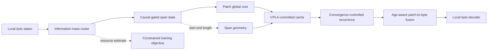
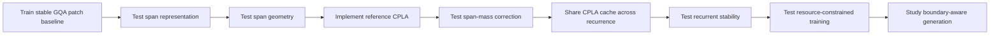

# CARS-R Mathematical Research Notebook

## Status

**Document type:** active derivation and empirical research notebook  
**Architecture:** CARS-R 0.1.0 research line  
**Purpose:** derive mathematics that fits the byte-to-patch hierarchy instead of forcing CARS-R into equations designed for uniform token Transformers  
**Implementation rule:** formulas may enter 0.1.0 as explicitly marked research hypotheses after invariant and numerical checks; empirical acceptance still requires matched ablations and serious training

This file is deliberately not a polished theory paper. It records assumptions, candidate equations, rejected alternatives, unresolved questions, empirical observations, and the experiments required to decide between them. A failed derivation remains useful if it explains why a tempting design does not fit the system. Empirical entries are versioned and clearly separated from derivations so that later runs can revise a conclusion without rewriting the history of the hypothesis.

---

## 1. Mathematical design principle

CARS-R has four properties that ordinary token-level formulas do not fully model:

1. Input positions are bytes, but most global computation occurs on variable-length patches.
2. Each patch represents a span with a start, end, length, and information density—not merely one uniformly spaced token.
3. Historical patch memory can be compressed, while the active byte and active patch states should remain rich.
4. The shared patch block may be applied recurrently, so model depth is partly a dynamical process rather than a fixed stack.

The mathematical objective is therefore not to invent novelty for its own sake. A new formula is justified only when it expresses one of these system properties more faithfully than a standard equation.

The research order is:


---

## 2. Non-negotiable invariants

Every proposed equation must preserve the relevant subset of these invariants.

### 2.1 Causality

For a prediction at byte position \(t\), no quantity may depend on bytes after \(t\):

\[
\frac{\partial y_t}{\partial x_u}=0,\qquad u>t.
\]

### 2.2 Patch-length constraints

Every completed patch \(j\) must satisfy:

\[
L_{\min}\le L_j\le L_{\max},
\]

except a final truncated patch at the end of a padded training sample.

### 2.3 Exact local path

Global patch information may be added to the byte state, but the local byte state must not be destroyed by compression:

\[
x_t^{\text{decode}}=h_t^{\text{local}}+\Delta_t^{\text{global}}.
\]

The coefficient of the local residual is fixed at one in the initial research line.

### 2.4 Incremental/full equivalence

For identical weights and tokens:

\[
\operatorname{logits}_{\text{full}}(x_{\le t})
\approx
\operatorname{logits}_{\text{cached}}(x_{\le t}).
\]

### 2.5 Resource honesty

A claimed efficiency gain must use measured or analytically explicit compute and memory. Parameter count alone is not a compute metric.

---

## 3. Map of new mathematical work

| Research area | 0.1.0 implementation | Empirical status | Next controlled question | Code location |
|---|---|---|---|---|
| Boundary formation | bounded causal information-mass segmentation | implemented, unvalidated at scale | does it beat fixed patches at matched compression? | `CausalPatchRouter` |
| Patch representation | mean, causal ending state, ordinal-weighted state, and length embedding | implemented, unvalidated at scale | which summaries are necessary at equal width? | `CausalPatchRouter.forward` and `compress_incremental` |
| Position geometry | dual patch-index and original-byte-centre RoPE in CPLA | implemented hypothesis | does dual geometry beat byte-centre-only and patch-index-only controls? | `DualSpanRoPE` and `CPLA` |
| Global latent attention | CPLA with matched patch GQA control | implemented hypothesis | what latent rank preserves quality while reducing cache? | `CPLA`, `PatchGQA` |
| Patch attention mass | optional learned log-span correction | implemented hypothesis | does it improve variable-span attention or introduce bias? | `CPLA._attend` |
| Recurrent computation | shared patch block with learned normalized step scale | implemented hypothesis | does depth improve quality beyond equal-compute controls? | `RecurrentPatchBlock`, `CARSRModel._run_patch_core` |
| Patch-to-byte fusion | age-, span-, and router-aware gate with unit local residual | implemented hypothesis | does the global path add long-range value without harming exactness? | `CARSRModel.forward` |
| Compression objective | next-byte loss plus warmed target-rate regularization | implemented baseline | should later work use measured resource constraints instead? | model loss and experiment runner |
| Cache theory | local ring caches, completed-patch caches, and one recurrent history cache | implemented and unit-tested | do analytical savings become hardware savings? | cache classes and benchmark command |
| Research allocation | resumable Thompson scheduler outside the model | implemented optional infrastructure | does it save budget versus fixed allocation? | `cars.experiment` |
| Future decoding | one byte per autoregressive step | intentionally deferred | can local drafting reduce byte-step latency safely? | future generation study |

The remainder of this notebook derives candidate formulas for these areas.

---

# Part I — Causal patch formation

## 4. What the router should represent

The router should answer a system-specific question:

> Has the current patch accumulated enough new information that another global state is worth creating?

This is different from asking whether a linguistic token boundary exists. Patches are computational units, not necessarily words or subwords.

Let:

- \(h_t\in\mathbb R^D\): causal local byte state;
- \(s_t\): current causal patch summary;
- \(\ell_t\): current patch length before consuming byte \(t\);
- \(n_t\): local novelty;
- \(u_t\): summary saturation or reconstruction uncertainty.

A boundary mechanism should combine semantic novelty, current patch capacity, and the resource budget.

---

## 5. Candidate A — bounded affine hazard

This is the current simple baseline:

\[
q_t=\sigma(f_\theta(h_t,h_t-h_{t-1},\cos(h_t,h_{t-1}))),
\]

\[
a_t=\frac{1}{L_{\max}}+
\left(\frac{1}{L_{\min}}-\frac{1}{L_{\max}}\right)q_t,
\]

\[
A_t=\sum_{i\le t}a_i,
\qquad
j_t=\lfloor A_t\rfloor.
\]

A boundary occurs when \(j_t>j_{t-1}\).

### Advantages

- causal;
- fully vectorizable;
- gives a direct gradient path;
- initializes near a chosen average ratio;
- easy to make incremental/full equivalent.

### Weaknesses

- \(a_t\) is interpreted only as a boundary rate;
- no explicit representation of information already stored in the current patch;
- target ratio can dominate semantic structure;
- local score calibration may drift across domains.

**Status:** keep as baseline, not assumed final.

---

## 6. Candidate B — causal information-mass segmentation

Reinterpret each byte as contributing an adaptive amount of information mass to the current patch.

First estimate novelty:

\[
n_t=\operatorname{softplus}\left(
 w_n^\top [h_t;h_t-h_{t-1};h_t-s_{t-1}]
\right).
\]

Maintain a causal running calibration:

\[
\mu_t=\rho\mu_{t-1}+(1-\rho)\operatorname{stopgrad}(n_t).
\]

Convert novelty into normalized mass:

\[
\widetilde m_t=\frac{1}{R_*}
\exp\left(\eta\frac{n_t-\mu_t}{\mu_t+\epsilon}\right),
\]

\[
m_t=\operatorname{clip}
\left(\widetilde m_t,\frac{1}{L_{\max}},\frac{1}{L_{\min}}\right).
\]

Then:

\[
M_t=\sum_{i\le t}m_i,
\qquad
j_t=\lfloor M_t\rfloor.
\]

### Interpretation

- predictable/redundant bytes contribute less mass and form longer patches;
- surprising or structurally changing bytes contribute more mass and close patches sooner;
- \(R_*\) controls the global resource budget;
- causal calibration prevents one domain’s raw novelty scale from controlling patch length.

### Potential flaw

The exponential can amplify noise and cause unstable patch lengths. The clipped interval protects hard limits but may produce many saturated values, making the router effectively binary.

### Trial

Compare exponentials with:

\[
\widetilde m_t=\frac{1}{R_*}
\left[1+\eta\tanh\left(\frac{n_t-\mu_t}{\mu_t+\epsilon}\right)\right].
\]

**Status:** primary router candidate for research after the baseline is trained.

---

## 7. Candidate C — compression-debt clock

Let a patch accumulate compression debt when its representation is asked to absorb difficult bytes:

\[
d_t=(1-b_{t-1})d_{t-1}+\phi_t,
\]

where:

\[
\phi_t=\operatorname{softplus}
\left(w^\top[h_t;s_{t-1};h_t-s_{t-1};\ell_t/L_{\max}]\right).
\]

Close the patch when:

\[
b_t=\mathbf 1[d_t\ge \tau].
\]

### Why it fits CARS-R

The boundary is triggered by the current patch representation’s capacity, not only by adjacent-byte difference.

### Why it may fail

- recursive reset makes fully parallel training harder;
- straight-through reset gradients may be unstable;
- the threshold and scale of \(\phi_t\) are not identifiable without a resource constraint.

**Status:** conceptually strong, but secondary until a parallel formulation is found.

---

## 8. Router acceptance tests

A new router formula is accepted only if it satisfies all of these:

1. Direct nonzero language-loss gradient reaches router parameters.
2. Full and incremental boundaries are identical.
3. No CPU synchronization defines patches.
4. Patch lengths satisfy hard bounds.
5. Mean ratio is controllable without forcing every patch toward the same length.
6. Boundary entropy remains nonzero during training.
7. It beats fixed patches at matched measured compute on at least two domains.
8. It does not obtain gains solely through a larger number of patches.

---

# Part II — Order-aware patch representation

## 9. Problem with mean-plus-end compression

The current patch state is approximately:

\[
p_j=W_p[\mu_j;h_{e_j}],
\qquad
\mu_j=\frac{1}{L_j}\sum_{t=s_j}^{e_j}h_t.
\]

The ending state is causal and order-aware, but the mean loses internal order and uncertainty. Two spans can share similar means and ending states while differing internally.

---

## 10. Candidate A — causal gated span state

Within each patch, maintain:

\[
g_t=\sigma(W_g[h_t;u_{t-1};r_t]),
\]

\[
u_t=g_t\odot u_{t-1}+(1-g_t)\odot W_u h_t,
\]

where \(r_t\) is relative progress within the patch.

At patch closure:

\[
p_j=W_p[h_{e_j};u_{e_j};\mu_j].
\]

### Interpretation

- \(h_{e_j}\): final causal local state;
- \(u_{e_j}\): ordered recurrent summary;
- \(\mu_j\): stable low-variance aggregate.

### Incremental cost

Only one \(D\)-dimensional state is updated per byte. No replay is required when the patch closes.

### Risk

The gated accumulator may become another miniature recurrent model and duplicate the local encoder. It should remain one lightweight update, not a separate deep module.

**Status:** preferred first replacement for mean-plus-end compression.

---

## 11. Candidate B — span sufficient statistics

Store:

\[
\mu_j=\frac{1}{L_j}\sum h_t,
\]

\[
v_j=\frac{1}{L_j}\sum(h_t-\mu_j)^2,
\]

\[
\Delta_j=h_{e_j}-h_{s_j}.
\]

Then:

\[
p_j=W_p[h_{e_j};\mu_j;v_j;\Delta_j].
\]

### Strength

This explicitly represents central tendency, dispersion, and direction of change.

### Weakness

It still does not uniquely represent order, and concatenating four full-width vectors increases parameters and projection cost.

**Status:** useful ablation, not preferred default.

---

## 12. Span representation tests

- byte-order perturbation test within a patch;
- reconstruction probe of held-out local states;
- next-byte BPB at matched patch sequence length;
- incremental/full equivalence;
- closure latency;
- representation norm versus patch length;
- sensitivity to repeated bytes and code identifiers.

---

# Part III — Variable-span geometry

## 13. Why patch index alone is incomplete

Suppose three patches have lengths \(2,7,3\). Their patch indices are \(0,1,2\), but their byte centers and boundaries are not uniformly spaced.

Define for patch \(j\):

\[
s_j=\text{start byte},\qquad
e_j=\text{end byte},
\]

\[
c_j=\frac{s_j+e_j}{2},\qquad L_j=e_j-s_j+1.
\]

CARS-R needs a geometry that represents both computational order and original byte distance.

---

## 14. Candidate A — dual-coordinate rotary position

Split the rotary dimensions into patch-order and byte-location channels:

\[
r_j=
\left[
\operatorname{RoPE}_{p}(j);
\operatorname{RoPE}_{b}(e_j)
\right].
\]

### Strength

Simple, explicit, and compatible with CPLA’s separate positional cache.

### Weakness

A hard split assumes some frequencies should see only patch order and others only byte position.

**Status:** safe CPLA baseline.

---

## 15. Candidate B — span phase encoding

For frequency channel \(m\), define:

\[
\varphi_{j,m}
=
\omega_m c_j
+
\alpha_m j
+
\gamma_m\log(1+L_j).
\]

Queries and keys rotate using \(\varphi_{j,m}\).

### Interpretation

- \(c_j\): original byte location;
- \(j\): computational patch order;
- \(L_j\): span scale;
- \(\alpha_m,\gamma_m\): learned but bounded coefficients.

### Desired property

The relative phase between patches \(i\) and \(j\) becomes:

\[
\Delta\varphi_{ij,m}
=
\omega_m(c_i-c_j)
+
\alpha_m(i-j)
+
\gamma_m\log\frac{1+L_i}{1+L_j}.
\]

This directly exposes byte distance, patch distance, and scale mismatch.

### Risk

Length phase can distort positional smoothness and may be redundant with explicit length embeddings.

**Status:** high-value research candidate after dual-coordinate RoPE baseline.

---

# Part IV — CPLA: CARS-R Patch Latent Attention

## 16. Design objective

CPLA should compress only long-lived historical patch memory. It should not compress:

- the active local byte state;
- the active recurrent patch state;
- exact current-patch information.

A completed patch produces one committed latent cache entry after its patch-level processing is complete.

---

## 17. Baseline CPLA state

For final committed patch state \(z_j\), length \(L_j\), and span coordinates:

\[
u_j=z_j+E_L(L_j),
\]

\[
c_j=W_{DKV}u_j\in\mathbb R^{d_c},
\]

\[
r_j=\operatorname{SpanPosition}(j,s_j,e_j,L_j)\in\mathbb R^{d_r}.
\]

The cache row is:

\[
\mathcal C_j=(c_j,r_j).
\]

The first configuration to test is:

\[
d_c=48,\qquad d_r=16.
\]

This is a hypothesis, not a fixed truth.

---

## 18. CPLA attention score

For current recurrent query state \(z_i^{(k)}\) and head \(h\):

\[
q_{i,h}^{C}=W_{QC,h}z_i^{(k)},
\qquad
q_{i,h}^{R}=W_{QR,h}z_i^{(k)}.
\]

With absorbed content-key transformation:

\[
\widetilde q_{i,h}^{C}=W_{UK,h}^{\top}q_{i,h}^{C}.
\]

Then:

\[
s_{ijh}
=
\frac{
\langle\widetilde q_{i,h}^{C},c_j\rangle
+
\langle q_{i,h}^{R},r_j\rangle
}{\sqrt{d_h}}.
\]

The value read is:

\[
o_{i,h}
=
\sum_{j<i}\alpha_{ijh}W_{UV,h}c_j.
\]

Historical cache rows stay fixed across recurrent updates of the current patch.

---

## 19. New formula — span-mass correction

A standard attention layer treats every patch as one item. But patch \(j\) represents \(L_j\) bytes.

Assume, for derivation only, that token-level logits within a patch are approximately equal to \(a_j\). The total softmax mass assigned to that patch would be:

\[
\sum_{t\in j}e^{a_j}=L_j e^{a_j}=e^{a_j+\log L_j}.
\]

Therefore a patch-level approximation to byte-level attention should test:

\[
\widehat s_{ijh}=s_{ijh}+\lambda_h\log L_j.
\]

### Interpretations

- \(\lambda_h=1\): mass-preserving approximation under equal within-patch logits;
- \(\lambda_h=0\): ordinary patch attention;
- learned \(\lambda_h\in[0,1]\): head-specific interpolation.

### Why this is important

Without correction, an eight-byte patch and a two-byte patch each receive one softmax entry even though they summarize different amounts of source material.

### Failure possibility

If the patch compressor already produces states whose norm or content encodes span mass, adding \(\log L_j\) may double-count length. The experiment must compare fixed \(0\), fixed \(1\), and learned bounded \(\lambda_h\).

**Status:** one of the strongest new formula candidates.

---

## 20. New formula — fixed-shape adaptive effective rank

Variable latent widths are inefficient for batching. Instead keep a fixed cache width and learn a span-conditioned dimension gate:

\[
g_j=\sigma(W_g[z_j;E_L(L_j);u_j^{\text{router}}]),
\]

\[
c_j=g_j\odot W_{DKV}z_j.
\]

All rows remain \(d_c\)-dimensional, but the effective rank can vary.

Add a gate-cost term:

\[
C_j^{\text{rank}}=\frac{1}{d_c}\sum_{r=1}^{d_c}g_{j,r}.
\]

### Benefit

Dynamic information allocation without ragged cache rows.

### Risk

A soft gate does not reduce physical cache bytes unless dimensions become structured and prunable. Initially this is a representation experiment, not a systems claim.

**Status:** later CPLA study, not version-one implementation.

---

## 21. CPLA cache law

For batch size \(B\), patch layers \(N_p\), average patch length \(R\), input bytes \(T\), cache element bytes \(s\), and latent widths \(d_c,d_r\):

\[
P\approx\frac{T}{R},
\]

\[
M_{\text{CPLA}}
\approx
B N_p \frac{T}{R}(d_c+d_r)s.
\]

Current GQA patch cache is approximately:

\[
M_{\text{GQA}}
\approx
B N_p \frac{T}{R}
\left(2n_{kv}d_h\right)s.
\]

CPLA beats GQA in cache size when:

\[
d_c+d_r<2n_{kv}d_h.
\]

Relative patch-cache reduction is:

\[
1-\frac{d_c+d_r}{2n_{kv}d_h}.
\]

Relative to full byte-level GQA history, the combined hierarchical compression factor is approximately:

\[
\frac{M_{\text{CPLA-patch}}}{M_{\text{GQA-byte}}}
\approx
\frac{d_c+d_r}{R\left(2n_{kv}d_h\right)}.
\]

This equation captures the intended cooperation:

- patching reduces the number of cached positions by roughly \(R\);
- CPLA reduces features stored per cached position.

---

## 22. Recurrence-independent historical cache

The active patch may be refined \(K\) times:

\[
z_i^{(k+1)}=z_i^{(k)}+F_\theta(z_i^{(k)},\mathcal C_{<i}).
\]

The historical cache \(\mathcal C_{<i}\) is shared across all \(K\) steps. Therefore the historical cache should scale as:

\[
M_{\text{history}}=O(P(d_c+d_r)),
\]

not:

\[
O(KP(d_c+d_r)).
\]

This is a CARS-R requirement. An implementation that allocates a separate historical cache for every recurrent step is mathematically inconsistent with the intended committed-memory interpretation.

---

# Part V — Recurrent patch dynamics

## 23. Problem with unconstrained repeated blocks

A shared block applied repeatedly can improve depth efficiency, but nothing guarantees that another update is stable or useful.

The basic recurrence is:

\[
z^{(k+1)}=z^{(k)}+F_\theta(z^{(k)},C).
\]

Possible failures include exploding updates, oscillation, representation collapse, or quality that worsens at larger depth.

---

## 24. Candidate A — normalized recurrent step

Define:

\[
\Delta z^{(k)}=F_\theta(\operatorname{RMSNorm}(z^{(k)}),C,k),
\]

\[
\eta_k=\frac{\eta_0}{\sqrt{k+1}},
\]

\[
z^{(k+1)}=z^{(k)}+\eta_k\Delta z^{(k)}.
\]

### Strength

Simple diminishing steps discourage late-depth instability.

### Weakness

The optimal refinement magnitude may not decrease monotonically.

**Status:** low-risk baseline for deeper recurrence.

---

## 25. Candidate B — convergence-gated recurrence

Compute:

\[
g^{(k)}=\sigma\left(
W_g[z^{(k)};\Delta z^{(k)};|\Delta z^{(k)}|]
\right),
\]

\[
z^{(k+1)}=z^{(k)}+g^{(k)}\odot\Delta z^{(k)}.
\]

Use a convergence statistic:

\[
c^{(k)}=\frac{\|g^{(k)}\odot\Delta z^{(k)}\|_2}
{\|z^{(k)}\|_2+\epsilon}.
\]

For the first research version, \(c^{(k)}\) is diagnostic only. It should not yet control dynamic halting.

### Reason

First establish that the recurrent process converges and improves quality before adding another discrete routing mechanism.

**Status:** preferred recurrence diagnostic candidate.

---

## 26. New objective — elastic-depth consistency

Let \(p^{(k)}_t\) be the next-byte distribution at recurrent depth \(k\), and let \(K\) be the deepest training depth.

Train shallower depths toward the deepest distribution without forcing equality:

\[
L_{\text{elastic}}
=
\sum_{k<K}\omega_k
\operatorname{KL}
\left(
\operatorname{stopgrad}(p^{(K)}_t)
\,\|\,
 p^{(k)}_t
\right).
\]

This is combined with next-byte loss at sampled depths.

### Intended result

One checkpoint should expose a smoother quality–compute curve.

### Risk

Deep predictions may be wrong early in training, causing shallow depths to imitate noise. Use a delayed schedule or confidence weighting.

**Status:** test only after ordinary multi-depth training establishes a stable baseline.

---

## 27. New diagnostic — monotonicity violation

For held-out loss \(\ell_k\) at depth \(k\):

\[
V_{\text{mono}}
=
\frac{1}{K-1}
\sum_{k=1}^{K-1}
\max(0,\ell_{k+1}-\ell_k).
\]

This should be reported, not necessarily optimized directly. A low mean loss at maximum depth can hide highly unreliable intermediate depths.

---

# Part VI — Patch-to-byte fusion

## 28. Current additive gate

The present idea is:

\[
x_t=h_t+\sigma(W_g[h_t;c_{j-1}])\odot W_c c_{j-1}.
\]

This preserves the local residual, which is good. But the same completed-patch context may be used throughout a long current patch and becomes increasingly stale.

---

## 29. Candidate — age- and span-aware fusion

Let:

- \(a_t\): number of bytes since the last completed patch;
- \(L_{j-1}\): length of the context patch;
- \(q_t\): current router mass or boundary pressure.

Define:

\[
\rho_t=\frac{a_t}{L_{\max}},
\qquad
\lambda_{j-1}=\log(1+L_{j-1}).
\]

Then:

\[
g_t=
\sigma\left(
W_g[h_t;W_c c_{j-1};\rho_t;\lambda_{j-1};q_t]
\right),
\]

\[
x_t=h_t+g_t\odot W_c c_{j-1}.
\]

### Interpretation

The decoder can learn whether global context should weaken, strengthen, or change form as the unfinished patch grows.

### Alternative decay prior

Initialize a scalar context-age bias:

\[
b_{\text{age}}(a_t)=-\kappa\frac{a_t}{L_{\max}}.
\]

This encodes the hypothesis that old patch context becomes less directly useful inside a long active patch. The model may learn away from it.

### Risk

Age is correlated with boundary decisions and may create feedback that encourages premature closure. Router and fusion gradients must be inspected separately.

**Status:** high-priority fusion ablation.

---

# Part VII — Resource-constrained training

## 30. Problem with target-rate loss

The current compression penalty is approximately:

\[
L_{\text{rate}}=
\left(\frac{1}{T}\sum_t a_t-\frac{1}{R_*}\right)^2.
\]

This controls average patch ratio but does not directly optimize measured compute, cache memory, or latency. Two routers can have the same average ratio and different system cost because of padding, patch distribution, and recurrent depth.

---

## 31. New formulation — constrained rate–distortion–resource learning

The research problem should be stated as:

\[
\min_\theta\quad L_{\text{LM}}(\theta)
\]

subject to:

\[
C_{\text{train}}(\theta)\le C_*^{\text{train}},
\]

\[
M_{\text{cache}}(\theta)\le M_*^{\text{cache}},
\]

\[
E_{\text{exact}}(\theta)\le E_*^{\text{exact}}.
\]

A practical Lagrangian is:

\[
L=
L_{\text{LM}}
+\lambda_C(C-C_*)
+\lambda_M(M-M_*)
+\lambda_E(E-E_*).
\]

Dual variables are updated separately:

\[
\lambda_C\leftarrow
\left[\lambda_C+\eta_C(C-C_*)\right]_+,
\]

with analogous updates for \(\lambda_M,\lambda_E\).

### Why this is more appropriate

The architecture is explicitly about allocating computation. A fixed patch-ratio penalty is only an indirect proxy for that goal.

### Practical first approximation

Before differentiable hardware models exist, use analytical expected costs:

\[
\widehat C_{\text{patch}}
=\kappa_p\sum_t m_t,
\]

\[
\widehat M_{\text{CPLA}}
=\kappa_m(d_c+d_r)\sum_t m_t.
\]

Coefficients \(\kappa_p,\kappa_m\) are calibrated from benchmark measurements.

### Risk

Hardware-specific coefficients may overfit one accelerator. Report both analytical and measured results.

**Status:** central long-term training formulation; begin only after stable base training with target ratio.

---

## 32. Rate–distortion surface, not one score

Do not hide the result inside one composite metric. Report the Pareto surface over:

\[
(\text{BPB},\text{training FLOPs},\text{decode latency},\text{cache bytes},\text{exactness}).
\]

A formula is useful for training constraints, but scientific comparison should show the frontier.

---

# Part VIII — Future boundary-aware generation

## 33. Remaining byte-step bottleneck

Even with patch-level global computation, autoregressive generation still emits one byte at a time.

A future system-native approach is local drafting until the next predicted patch closure.

Let the local decoder propose a byte block:

\[
\widehat x_{t+1:t+m}\sim p_{\text{local}}.
\]

The router predicts a closure at \(m\), after which the global patch core verifies the draft.

A simple acceptance statistic is:

\[
A=
\sum_{r=1}^{m}
\left[
\log p_{\text{full}}(\widehat x_{t+r})
-
\log p_{\text{local}}(\widehat x_{t+r})
\right].
\]

Accept the draft if:

\[
A\ge -\tau_m.
\]

### Why it belongs later

This mechanism depends on a well-trained router and reliable local/global factorization. It should not complicate base architecture validation.

**Status:** future research only.

---

# Part IX — Trial-and-error protocol

## 34. One-formula-at-a-time rule

Only one mathematical change is introduced per ablation family. For example, CPLA experiments should not simultaneously change:

- latent dimension;
- positional formula;
- span-mass correction;
- recurrence rule;
- router objective.

Otherwise attribution is lost.

---

## 35. Required notebook entry for each trial

Every trial added below must include:

```text
Trial ID:
Date:
Hypothesis:
Baseline equation:
Candidate equation:
Changed code path:
Unchanged controls:
Expected benefit:
Known failure modes:
Unit tests:
Training setup:
Measured results:
Decision: accept / revise / reject
Reason:
```

---

## 36. Initial trial queue

### MATH-001 — Span-mass correction

- Baseline: \(s_{ijh}\)
- Candidate: \(s_{ijh}+\lambda_h\log L_j\)
- Controls: \(\lambda=0\), \(\lambda=1\), learned bounded \(\lambda_h\)
- Primary metric: BPB at matched patch ratio and compute
- Secondary metric: attention mass versus patch length

### MATH-002 — Dual-coordinate versus span-phase position

- Baseline: patch-index RoPE
- Candidate A: split patch-index and byte-end RoPE
- Candidate B: blended span phase
- Primary metric: long-context BPB and retrieval by byte distance

### MATH-003 — Causal gated span state

- Baseline: mean plus ending state
- Candidate: gated ordered summary plus mean and end
- Primary metric: BPB and byte-order perturbation probe

### MATH-004 — Information-mass router

- Baseline: affine bounded hazard
- Candidate: causally calibrated information mass
- Primary metric: learned versus fixed patch frontier
- Failure monitor: min/max saturation and domain drift

### MATH-005 — Age-aware fusion

- Baseline: local-plus-gated previous-patch context
- Candidate: add context age, previous span length, and router pressure
- Primary metric: exact-byte accuracy and BPB versus current patch position

### MATH-006 — Recurrence convergence diagnostics

- Baseline: shared block plus iteration embedding
- Candidate: normalized step and convergence gate
- Primary metric: depth-loss monotonicity and update norm

### MATH-007 — CPLA cache sharing across recurrence

- Baseline: separate recurrence caches
- Candidate: one committed historical latent cache shared by every recurrent query step
- Primary metric: cache bytes independent of recurrence depth
- Correctness metric: cached/full logit equivalence

### MATH-008 — Constrained resource objective

- Baseline: target patch-ratio penalty
- Candidate: dual-updated compute/cache constraints
- Primary metric: quality–resource Pareto frontier

### MATH-009 — Budgeted Thompson research allocation

- Baseline: equal additional training budget for every architecture arm
- Candidate: mandatory-bootstrap Thompson allocation with a Normal–Inverse-Gamma reward posterior
- Utility:

  \[
  R_a=-\operatorname{BPB}_a
  -\lambda_E(1-A_a^{\mathrm{risk}})
  -\lambda_M\rho_a^{\mathrm{cache}}
  -\lambda_DK_a
  +\lambda_T\log(1+v_a)
  \]

- Selection after bootstrap:

  \[
  \widetilde\mu_{a,t}\sim p(\mu_a\mid\mathcal H_t),
  \qquad
  a_t=\arg\max_a\widetilde\mu_{a,t}
  \]

- Primary metric: research compute required to identify the same finalists later confirmed by equal-budget multi-seed retraining
- Failure monitors: reward-coefficient sensitivity, early-arm starvation, non-stationary rewards, and posterior domination by short-run noise
- Status: implemented in the outer experiment loop; not part of model inference and not yet validated on a serious study

---

# Part X — Where each new idea enters the architecture

## 37. Model path



## 38. Code mapping and insertion points

Several 0.1.0 hypotheses are now implemented. This notebook remains the derivation record rather than the source of executable truth. The current mapping is:

1. **Router mathematics** enters `CausalPatchRouter._learned_boundaries` and `incremental_boundary`.
2. **Span compressor mathematics** enters `CausalPatchRouter.forward` and `compress_incremental`.
3. **Span geometry and CPLA** enter a patch-only attention backend inside `cars/model.py`.
4. **Committed recurrent cache sharing** replaces recurrence-depth-proportional historical KV allocation in `GenerationState`.
5. **Recurrent dynamics** enter `_run_patch_core` and `_increment_patch`.
6. **Age-aware fusion** enters the byte-aligned context expansion and incremental decoder fusion.
7. **Resource constraints, posterior updates, and Thompson allocation** enter `cars/experiment.py`.
8. **Metrics and acceptance tests** enter the existing single research test file and experiment runner rather than creating many new modules.

The implementation should remain concentrated in the existing files unless a backend becomes large enough that separation clearly reduces, rather than increases, research complexity.

---

# Part XI — Decisions currently made

## 39. Implemented design commitments

- Standard MLA will not be copied unchanged.
- CPLA will operate only on completed global patches.
- The active patch remains full-width during recurrent processing.
- Exact byte information remains in the local residual path.
- Variable patch span must be represented in position or attention mathematics.
- Historical latent cache should be shared across recurrent steps.
- New equations require matched ablations before becoming defaults.
- Thompson sampling may allocate exploratory research budget only after every arm receives a mandatory minimum pull.
- Adaptive allocation cannot replace final equal-budget multi-seed retraining.

## 40. Implemented but not yet empirically accepted, or still deferred

- the final CPLA latent rank;
- the final span-position equation;
- span-mass correction coefficient;
- information-mass router versus affine hazard;
- dynamic effective rank;
- convergence gates;
- learned per-patch halting;
- resource-constrained training coefficients;
- boundary-aware block generation;
- final Thompson reward coefficients and prior hyperparameters.

---

# Part XII — Research quality checklist

Before a new mathematical mechanism is described as a contribution, verify:

- [ ] The equation models a property unique or especially important to CARS-R.
- [ ] A simpler standard baseline is implemented and reported.
- [ ] Dimensions and tensor shapes are explicit.
- [ ] Causality is proven or directly tested.
- [ ] Full and incremental forms are derived together.
- [ ] Numerical stability is tested in FP32, BF16, and relevant cache dtypes.
- [ ] The formula has a falsifiable expected outcome.
- [ ] The ablation changes only the intended variable.
- [ ] Systems gains are measured on target hardware.
- [ ] Negative results remain in this notebook.
- [ ] README claims are updated only after evidence exists.

---


---

# Part XIII — Empirical mathematical notes for the 0.1.0 pilot

## 41. Why this appendix exists

The first 0.1.0 pilot produced enough evidence to update the mathematical status of several hypotheses. These notes record **what the measurements support**, not what the architecture was intended to do. They therefore supersede any earlier informal interpretation that conflicts with the corrected evaluation package.

The pilot remains limited by a small synthetic training corpus, one training seed, and a held-out set that has now been inspected. It is evidence for prioritizing later experiments, not a final scaling claim.

### Evaluation invariant: pure language-model BPB

CARS-R trains with an auxiliary compression term, but cross-model quality must be measured with pure language-model negative log-likelihood only. For original UTF-8 byte count \(B\):

\[
\operatorname{BPB}=\frac{-\sum_t\log_2 p(y_t\mid y_{<t})}{B}.
\]

Auxiliary compression loss, router regularization, or other training penalties are **not** part of this denominator or numerator. This rule is now a permanent evaluation invariant because an earlier evaluator incorrectly mixed the compression penalty into CARS-R quality.

---

## 42. Corrected five-model pilot measurements

The corrected evaluation package reports the following checkpoint-level results. Values are recorded here as the empirical state of the 0.1.0 pilot; publication-quality replication still requires multiple training seeds and a new blind evaluation set.

| Model | Input | Global attention | Corrected validation BPB | Corrected pilot-test BPB |
|---|---|---|---:|---:|
| CARS-R 0.1.0 | byte | CPLA | **1.89223** | **1.94020** |
| Dense Transformer | byte | GQA | 2.00147 | 2.06745 |
| Dense Transformer + MLA | byte | MLA | 1.89770 | **1.93592** |
| Dense Token Transformer | BPE | GQA | 1.96660 | 1.96774 |
| Dense Token Transformer + MLA | BPE | MLA | **1.95841** | **1.93224** |

### Pairwise pilot-test differences

Define

\[
\Delta(A,B)=\operatorname{BPB}_A-\operatorname{BPB}_B,
\]

so negative values favor CARS-R when \(A=\text{CARS-R}\).

The corrected package reports:

\[
\Delta(\text{CARS-R},\text{Byte GQA})
=1.94020-2.06745
\approx -0.12725,
\]

\[
\Delta(\text{CARS-R},\text{Byte MLA})
=1.94020-1.93592
\approx +0.00428,
\]

\[
\Delta(\text{CARS-R},\text{Token GQA})
=1.94020-1.96774
\approx -0.02754,
\]

\[
\Delta(\text{CARS-R},\text{Token MLA})
=1.94020-1.93224
\approx +0.00796.
\]

The practical interpretation is therefore:

- CARS-R clearly outperformed the byte-GQA control in this pilot.
- CARS-R also outperformed the token-GQA control on this pilot test.
- CARS-R and byte MLA were extremely close.
- CARS-R and token MLA were also extremely close.
- The pilot does **not** support a claim that CPLA/CARS-R is superior to MLA in quality.

The corrected paired bootstrap package reports a confidence interval crossing zero for both MLA comparisons, while the GQA comparisons favor CARS-R. These intervals quantify uncertainty over the fixed evaluation examples, **not uncertainty over training seeds**.

---

## 43. Empirical patch-compression note

The corrected patch analysis uses the model's actual hard boundaries and reports:

\[
\overline L_{\text{patch}}=5.10256\;\text{bytes/patch},
\qquad
\operatorname{median}(L)=5.
\]

Therefore the observed number of global patch positions per raw byte is approximately:

\[
\frac{P}{T}\approx\frac{1}{5.10256}\approx0.1960.
\]

Equivalently, the expensive patch-global path operates on roughly one fifth as many sequence positions as the raw byte stream:

\[
T=1024\;\text{bytes}
\quad\Rightarrow\quad
P\approx\frac{1024}{5.10256}\approx201\;\text{patches}.
\]

This is an important systems hypothesis, but it is **not by itself a speedup claim**. CARS-R still performs local byte computation and routing over all \(T\) bytes. The measured benefit must therefore be evaluated as:

\[
C_{\text{CARS-R}}(T)
= C_{\text{local}}(T)
+ C_{\text{router}}(T)
+ C_{\text{global}}(T/\overline L)
+ C_{\text{fusion}}(T),
\]

not simply \(C(T/\overline L)\).

### Current interpretation

The router is demonstrably **not a fixed-length 4-byte splitter** in the corrected examples, and the mean span exceeds the earlier nominal patch ratio. However, this does not yet prove that the learned boundaries are causally useful. The decisive experiment remains learned versus fixed patches at matched mean \(\overline L\), parameters, and compute.

**MATH-004 status:** *partially supported; not accepted as a quality contribution until the fixed-patch ablation is run.*

---

## 44. CPLA quality status after the pilot

The byte-MLA comparison is the most informative quality control because both systems operate on bytes and use latent global memory ideas. The corrected pilot test gives:

\[
\operatorname{BPB}_{\text{CARS-R}}=1.94020,
\qquad
\operatorname{BPB}_{\text{Byte MLA}}=1.93592.
\]

The gap is only:

\[
0.00428\;\text{BPB}.
\]

Thus the pilot supports the weaker and scientifically useful statement:

> CARS-R maintained approximately MLA-level byte modeling quality while using a hierarchical byte-to-patch global representation.

It does **not** establish that CPLA improves BPB relative to conventional MLA. CPLA must instead earn its place through a quality--memory--compute frontier.

The next systems comparison must report at matched original source length:

\[
(\operatorname{BPB},\;M_{\text{cache}},\;C_{\text{prefill}},\;C_{\text{decode}},\;\text{bytes/s}).
\]

**MATH-007 status:** cache-sharing correctness is implemented and unit-tested; hardware efficiency remains unaccepted until real occupied-cache scaling is measured for CARS-R and MLA under the same decoding protocol.

---

## 45. Recurrence note: depth has not earned extra iterations

A zero-training diagnostic on the frozen pilot checkpoint reported approximately:

| Recurrent depth | Validation BPB | Relative observation |
|---:|---:|---|
| \(K=1\) | 1.8878 | best of measured depths |
| \(K=2\) | 1.8880 | essentially identical |
| \(K=4\) | 1.8886 | slightly worse and slower |

The measured ordering does not support additional recurrent iterations:

\[
\operatorname{BPB}_{K=1}
\lesssim\operatorname{BPB}_{K=2}
<\operatorname{BPB}_{K=4}.
\]

However, \(K=0\) was not included in that diagnostic, so the experiment cannot determine whether **one recurrent refinement is useful at all**.

The next decisive comparison is:

\[
K=0\quad\text{vs}\quad K=1,
\]

preferably by controlled retraining if the inference-only diagnostic indicates a meaningful difference.

**MATH-006 status:** *revise/question*. Extra depth \(K>1\) currently has no empirical justification; recurrence itself remains unresolved until a \(K=0\) control exists.

---

## 46. What the pilot changes in the hypothesis queue

| ID | Hypothesis | 0.1.0 empirical update | Decision before next scale run |
|---|---|---|---|
| MATH-001 | span-mass correction | not isolated | keep optional; do not claim contribution |
| MATH-002 | variable-span position geometry | not isolated | keep frozen in 0.1.0; ablate later |
| MATH-003 | order-aware span state | model trains competitively, but component not isolated | keep frozen; no causal credit yet |
| MATH-004 | information-mass router | real variable spans, mean 5.10 bytes | partially supported; fixed-patch control still required |
| MATH-005 | age-aware fusion | not isolated | keep frozen; no independent claim |
| MATH-006 | recurrence | K>1 gives no observed benefit | question extra iterations; obtain K=0 evidence |
| MATH-007 | shared CPLA history | correctness tested; systems advantage not yet established | retain; benchmark actual occupied cache |
| MATH-008 | constrained resource objective | not validated | defer |
| MATH-009 | Thompson allocation | infrastructure only | optional; not part of model claim |

This table is intentionally conservative. A full architecture can perform well while individual mechanisms remain scientifically uncredited. Component credit requires an isolation experiment.

---

## 47. Statistical interpretation rule

The pilot used one training seed. Therefore example-level resampling cannot establish architecture-level training stability. Let \(D_s\) be the BPB difference at independently trained seed \(s\). The relevant quantity for architecture claims is eventually the distribution:

\[
\{D_{42},D_{43},D_{44},\ldots\},
\]

not merely bootstrap resamples of one fixed pair of checkpoints.

The next serious experiment should therefore report at minimum:

\[
\overline D=\frac{1}{S}\sum_{s=1}^{S}D_s,
\qquad
\operatorname{SE}(D)=\frac{\operatorname{sd}(D_s)}{\sqrt S}.
\]

For the current 0.1.0 pilot, use wording such as **"the fixed seed-42 checkpoint outperformed... on this held-out sample"**, not **"the architecture is statistically superior"**.

---

## 48. Evaluation-set lifecycle

The 400-record pilot test has now been inspected during development. It must therefore be treated as a **pilot test**, not a pristine final benchmark for later architecture revisions.

Any change after the 0.1.0 freeze requires either:

1. a newly frozen blind evaluation set, or
2. an external benchmark whose examples were not used to choose the revision.

This is now part of the mathematical experimental protocol because repeated test reuse changes the conditional distribution of reported results even when model equations are unchanged.

---

## 49. Next-scale mathematical experiment

The next-scale corpus is approximately 95.9 MB of training text, roughly 67 times the raw-byte exposure of the original 1.42 MB pilot. The architecture remains frozen for the first scale run.

The primary comparison is reduced to three finalists:

\[
\text{CARS-R 0.1.0},\qquad\text{Byte MLA},\qquad\text{Token MLA}.
\]

The common progress variable is **raw UTF-8 bytes seen**, not optimizer steps or native model positions. For model \(m\), report learning curves:

\[
\operatorname{BPB}_m(B_{\text{seen}}),
\qquad
\operatorname{BPB}_m(C_{\text{FLOPs}}),
\qquad
\operatorname{BPB}_m(t_{\text{wall}}).
\]

This separates three questions:

- **data efficiency:** quality at matched raw bytes seen;
- **compute efficiency:** quality at matched FLOPs;
- **systems efficiency:** quality at matched wall time/cache memory.

The first one-epoch run is a scaling probe, not a license to change the architecture mid-run.

---

## 50. Current mathematical achievement statement

The strongest defensible 0.1.0 statement is:

> Under the corrected single-seed pilot evaluation, CARS-R learned variable byte patches averaging about 5.10 bytes per global patch, substantially outperformed matched GQA controls on BPB, and remained within roughly 0.004--0.008 BPB of matched byte-MLA and token-MLA controls on the inspected pilot test. These results support continued study of hierarchical byte-to-patch latent attention, but they do not yet establish component-level causality, multi-seed superiority, or hardware efficiency.

That is the empirical mathematical position at the 0.1.0 architecture freeze.

## Closing position

CARS-R should not reject established mathematics merely because it is established. It should use standard equations where their assumptions match the system, and derive new ones where variable byte spans, committed latent patch memory, recurrent query refinement, or exact local residuals violate those assumptions.

The immediate mathematical research sequence is:



This order prevents CPLA, routing, recurrence, and training objectives from changing simultaneously. It also ensures that every new formula enters the project as a measured hypothesis rather than decorative complexity.
